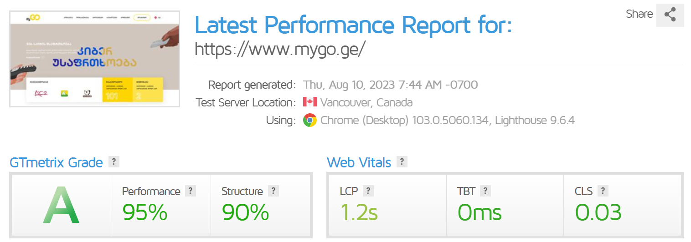

# Changelog

## 2025 Changelog

<details>

<summary>myGO - Digital Innovation Agency</summary>

#### 17.10.2025

**New**

* Forum (Beta) at forum.mygo.ge — categories, moderation rules, engagement mechanics.
* Finalized services lineup: Strategy, AI, WEB3, Web, Mobile, UX/UI, Hosting & Cloud, SEO, Online Ads.
* Case one-pager templates (Problem → Approach → Stack → Impact → KPIs).
* DeepSeek API integration for SEO content automation (Draft → QA → Publish workflow).
* Brand portfolio subpages for mySEO.dev, statoss.dev, linkers.dev (features, benefits, CTAs).
* Envato affiliate integration with cross-offers to Server1.
* Industry page series v1 — 10+ sectors (e.g., Healthcare, Education, E-commerce, Tourism, Finance).
* Cases Library — KPI-driven outcomes with measurable results.
* Pricing v2 — modular packages and add-ons, transparent comparison tables, guided selection wizard.
* Case study publications — downloadable PDFs/slides with shareable links.

**Improvements**

* Multilingual v2 — full hreflang coverage, slug normalization, stricter canonicals.
* Navigation IA — 6-block mega-menu with cleaner structure.
* Conversion rate optimization — above-the-fold testing, reduced form friction, behavior tracking.
* Frontend cleanup — fewer legacy jQuery dependencies, asset splitting.
* Internal Linking Engine v2 — JSON-driven automatic inserts tuned to content tone.
* Media optimization — WebP, lazy-loading; LCP target < 2.5s.
* Cross-sell funnel (MyGO → Server1) embedded on service pages.
* Performance and security hardening — stricter HTTP headers, harmonized caching policies.

**Fixes**

* Consistent breadcrumb trails across nested pages.
* Duplicate meta tags on select pages — unique title/description rules enforced.
* 404/redirect edge cases from legacy URLs — refined rewrite rules.
* Button/CTA contrast on dark backgrounds — improved readability and accessibility.

</details>

<details>

<summary>SERVER1 - Hosting Solutions</summary>

#### 20.10.2025

* **Simplified Domains & DNS** — new DNS panel with Anycast infrastructure:
  * 1-click records (A/AAAA, CNAME, MX, TXT)
  * Ready-made email presets (SPF/DKIM/DMARC)
  * DNSSEC enable/disable from a single toggle
  * Google Workspace / Zoho Mail automatic verification wizard
* **Fleet Payments integration** — a new payment channel for business clients with recurring invoices and aligned riders/terms.
* **Checkout v2** — fewer steps, faster verification, improved mobile UX.
* **DNS anti-abuse layers** — rate-limiting and automatic syntax validation for TXT records.
* **WHOIS contact sync on certain TLDs** — stabilization and unified profiles.
* **Self-Service OS Reinstall & Templates** — one-click OS reload + application templates (LAMP, Node.js, Docker-ready).
* **Monitoring Widgets in client panel** — CPU/RAM/Disk/Net charts covering 24 minutes to 30 days.
* **Backups v2** — incremental backups with a faster restore window.
* **NS propagation delays in certain zones** — Anycast profile rebalancing.
* **DDoS Protection Upgrade** — enhanced L3/L4 filtering for VPS and web hosting; improved anomaly logging in audit logs.
* **SLA crediting — automation** — automatic credit issuance to affected services immediately after incident confirmation.
* **Status Page v2** — real-time metrics by region with an RCA (root cause analysis) block for incidents.
* **Migration Assistant v2** — automatic rewrites and DNS cutover scenarios for zero/minimal-downtime migrations.

</details>

<details>

<summary>mySEO - SEO Tool</summary>

#### 2.3.0 - 07.10.2025

* Fixed the default Timezone not being applied to Guest users
* Other minor improvements

- Added the ability to create free plans on Regular License
- Added the ability to filter Users by Plan in the Admin Panel
- Improved the codebase (code refactoring)
- Improved the API Documentation
- Updated the Crawler's User-Agent to a newer version
- Updated all the dependencies to their latest versions
- Fixed filtering Payments by Plan not working
- Fixed password validation for Stats pages not working
- Improved the UI for sidebar and context menu elements
- Other minor improvements

</details>

<details>

<summary>Linkers - Smart Links</summary>

#### 3.8.0 - 25.10.2025

* Added a new Plan option: Link Alias
* Updated all the dependencies to their latest versions
* Fixed the User sidebar menu entries missing when the account was unconfirmed
* Fixed an issue causing some Pricing Plan labels not to display when they were set to zero
* Other minor improvements

- Fixed the default Timezone not being applied to Guest users
- Fixed not being able to add more than 2 Targets when editing a Link
- Other minor improvements

* Improved SEO for the Home page (sequential headings)
* Improved the UI for sidebar and context menu elements
* Fixed Stats being recorded one day in the past
* Fixed the New Domain page not including the required CNAME address
* Fixed Links API endpoint not returning the HTTPS protocol for main domain short URLs
* Fixed the Link Stats Privacy not defaulting to the User's preference
* Other minor improvements

- Added the ability to create free plans on Regular License
- Other minor improvements

* Added timezone support for all Stats pages
* Added Active Period for expiring links
* Added Sensitive Content warning option for links
* Added Continents targeting for Links
* Added Browsers targeting for Links
* Added Device targeting for Links
* Added CNAME DNS validation support when validating custom domains
* Added Webhooks on Domain Store, and Delete events
* Added the ability to filter Users by Plan in the Admin Panel
* Improved the codebase (code refactoring)
* Improved the API Documentation
* Updated the Crawler's User-Agent to a newer version
* Updated all the dependencies to their latest versions
* Fixed filtering Payments by Plan not working
* Fixed password validation for Stats pages not working
* Fixed missing field value on the Link's Edit page for Global Domains
* Fixed the Stats API endpoint not checking the Link ownership
* Other minor improvements

</details>

<details>

<summary>myGO - Analytics</summary>

#### 3.9.0 - 22.10.2025

* Fixed the default Timezone not being applied to Guest users
* Other minor improvements

- Added the ability to create free plans on Regular License
- Improved the UI for sidebar and context menu elements
- Other minor improvements

* Added timezone support for all Stats pages
* Added the ability to filter Users by Plan in the Admin Panel
* Improved the codebase (code refactoring)
* Improved the Search Engines list (added support for Brave, Naver, Sogou, and Qwant)
* Improved the Social Networks list (added support for Snapchat)
* Improved the API Documentation
* Improved SEO (image descriptions on Stats pages)
* Updated all the dependencies to their latest versions
* Fixed filtering Payments by Plan not working
* Other minor improvements

</details>

## 2024 Changelog

<details>

<summary>SERVER1 - Hosting Solutions</summary>

#### 07.10.2024

* **Billing enhancements** — multi-currency invoices (GEL/USD), automated invoicing, and payment links.
* **Full 2FA authentication** for the console (TOTP / Authenticator).
* **PHP 8.3 support** + updated **ionCube Loader 14.x**.
* **HTTP/3 (QUIC) enabled on Nginx** — improved latency across global locations.
* **Let’s Encrypt Wildcard (DNS-01)** — simple SSL for multiple subdomains.
* **Offsite backup systems** — daily backups to isolated storage (S3-compatible).
* **24/7 server monitoring** — real-time alerts (Email/Telegram).
* **Imunify360 / WAF profiles** — improved protection against brute-force and malware.
* **MariaDB / Redis upgrades** — lower latency and higher concurrency.
* **DKIM/SPF template inconsistencies** with some DNS providers — updated default profiles.
* **Node.js app hosting** — precise storage/quota calculation from the service plan.
* **Fast Migration Assistant** — automated transfers from cPanel/Plesk with minimal downtime.
* **Affiliates & Partnership program** — unique referral links and transparent campaign tracking.
* **Status Page v1** — real-time status, scheduled maintenance, and incident reports.
* **DDoS protection (L3–L4, upstream)** — foundational filtering for VPS/hosting.
* **Simplified checkout** — fewer steps, faster ordering, improved mobile UX.
* **Centralized logging** — faster incident analysis and audit trails.

</details>

<details>

<summary>mySEO - SEO Tool</summary>

#### 2.2.0 - 20.08.2024 <a href="#id-2.1.0-20.03.2024" id="id-2.1.0-20.03.2024"></a>

* Added Bulk Actions for Users, Pages, Reports, and Projects
* Added the ability to upload avatar images for Users
* Added the ability to store user uploaded files using an S3 filesystem (Amazon S3, DigitalOcean Spaces, Backblaze B2, etc.)
* Improved placeholder visibility on all inputs
* Updated all the dependencies to their latest versions
* Other minor improvements

- Added the ability for the Admin to enable support for HTTP/2 requests for the Crawler (disabled by default)
- Added support for special characters when exporting data in CSV format
- Added custom design for 4xx and 5xx error pages
- Updated the Crawler's User-Agent to a newer version
- Updated all the dependencies to their latest versions
- Fixed an issue preventing checking out using the Bank Transfer method
- Other minor improvements

* Improved the Webhooks for User events (added email verification date information to the payload)
* Improved the Bank Transfer Reference ID number format (the number is now shorter and capitalized)
* Updated all the dependencies to their latest versions
* Fixed an issue with the API based Tools appearing as available when being disabled
* Other minor improvements

#### 2.1.0 - 20.03.2024 <a href="#id-2.1.0-20.03.2024" id="id-2.1.0-20.03.2024"></a>

* Added new SEO report test: HTTP/2
* Added new SEO report test: HTST
* Added new SEO report test: DOCTYPE
* Added new Tool: Uptime Calculator
* Added new Tool: Meta Tags Checker
* Added new Tool: HTTP Headers Checker
* Added new Authentication system: Google Account
* Added new Authentication system: Microsoft Account
* Added new Authentication system: Apple Account
* Added new Captcha driver: hCaptcha
* Added new Captcha driver: Turnstile
* Added new social profile footer links: LinkedIn, Github, Discord, Reddit, Threads, TikTok, Tumblr, Pinterest
* Added User's Preferences to the Account API endpoint
* Added Category filters to Tools section
* Added a short description to every Tool
* Improved the codebase (code refactoring)
* Improved user's privacy when navigating on external links
* Improved SEO (sequential headings, anchor descriptions, image descriptions)
* Improved accessibility (footer elements now have descriptive text for screen readers)
* Improved the crawling performance by using the HTTP/2 protocol when fetching URLs
* Updated all the dependencies to their latest versions
* Updated the versioning system to major versions only
* Fixed the UTM Builder Tool result generating incorrect parameter names
* Fixed the WHOIS Lookup Tool not having Captcha protection
* Fixed the usage number on Account Plan page not being formatted
* Fixed current date time references potentially not being the same across a page load
* Fixed the Reports not being deleted when a User is deleted
* Other minor improvements

</details>

<details>

<summary>Linkers - Smart Links</summary>

#### 3.7.2 - 21.08.2024

* Added Bulk Actions for Users, Pages, Links, Spaces, Domains, and Pixels
* Added the ability to upload avatar images for Users
* Added the ability to store user uploaded files using an S3 filesystem (Amazon S3, DigitalOcean Spaces, Backblaze B2, etc.)
* Improved placeholder visibility on all inputs
* Updated all the dependencies to their latest versions
* Other minor improvements

- Improved confirmation pages for custom domain short links (no longer shows any branding)
- Fixed shortening links as Guest not working while a captcha service is enabled
- Fixed web resources not loading when redirecting a custom domain short link without HTTPS enabled
- Fixed short links with X retargeting pixel not working
- Fixed the PHP version requirement always showing as OK during the installation process
- Other minor improvements

#### 3.7.1 - 15.03.2024

* Added the ability for the Admin to translate Pages from the Admin Panel
* Added the ability for the Admin to force HTTPS scheme on the website (enabled by default)
* Added the ability for the Admin to disable the Contact form
* Added the ability for the Admin to display Contact Email, Phone, and Address on the Contact page
* Added the ability for the Admin to enable support for HTTP/2 requests for the Crawler (disabled by default)
* Added support for special characters when exporting data in CSV format
* Added custom design for 4xx and 5xx error pages
* Improved the Webhooks for User events (added email verification date information to the payload)
* Improved the Bank Transfer Reference ID number format (the number is now shorter and capitalized)
* Improved the Features section on the Home page
* Updated the versioning system to major versions only
* Updated the Crawler's User-Agent to a newer version
* Updated all the dependencies to their latest versions
* Fixed links being appended UTM tags unintended
* Other minor improvements

#### 3.7.0 - 27.01.2024 <a href="#id-3.7.0-27.01.2024" id="id-3.7.0-27.01.2024"></a>

* Added new Authentication system: Google Account
* Added new Authentication system: Microsoft Account
* Added new Authentication system: Apple Account
* Added new Captcha driver: hCaptcha
* Added new Captcha driver: Turnstile
* Added new social profile footer links: LinkedIn, Github, Discord, Reddit, Threads, TikTok, Tumblr, Pinterest
* Added new hero section on the Home page
* Improved the codebase (code refactoring)
* Improved user's privacy when navigating on external links
* Improved SEO (sequential headings, anchor descriptions, image descriptions)
* Improved accessibility (footer elements now have descriptive text for screen readers)
* Improved the Features section on the Home page
* Updated all the dependencies to their latest versions
* Fixed the usage number on Account Plan page not being formatted
* Fixed current date time references potentially not being the same across a page load
* Fixed month February missing in certain date range stats selections
* Fixed the Plan section under Account not including the number of Websites created
* Other minor improvements

</details>

<details>

<summary>myGO - Analytics</summary>

#### 3.8.0 - 11.07.2024 <a href="#id-3.7.0-27.01.2024" id="id-3.7.0-27.01.2024"></a>

* Added Bulk Actions for Users, Pages, and Websites
* Added the ability to upload avatar images for Users
* Added the ability to store user uploaded files using an S3 filesystem (Amazon S3, DigitalOcean Spaces, Backblaze B2, etc.)
* Improved placeholder visibility on all inputs
* Updated all the dependencies to their latest versions
* Other minor improvements

- Added support for special characters when exporting data in CSV format
- Added custom design for 4xx and 5xx error pages
- Updated all the dependencies to their latest versions
- Fixed an issue preventing checking out using the Bank Transfer method
- Fixed the PHP version requirement always showing as OK during the installation process
- Other minor improvements

* Added the ability for the Admin to translate Pages from the Admin Panel
* Added the ability for the Admin to force HTTPS scheme on the website (enabled by default)
* Added the ability for the Admin to disable the Contact form
* Added the ability for the Admin to display Contact Email, Phone, and Address on the Contact page
* Added the ability to mark Websites as Favorite (favorite websites will show up in the sidebar)
* Improved the Webhooks for User events (added email verification date information to the payload)
* Improved the Bank Transfer Reference ID number format (the number is now shorter and capitalized)
* Updated the versioning system to major versions only
* Updated all the dependencies to their latest versions
* Fixed missing Demo button on the Home page when a Demo URL was set
* Other minor improvements

#### 3.7.0 - 27.01.2024 <a href="#id-3.7.0-27.01.2024" id="id-3.7.0-27.01.2024"></a>

* Added new Authentication system: Google Account
* Added new Authentication system: Microsoft Account
* Added new Authentication system: Apple Account
* Added new Captcha driver: hCaptcha
* Added new Captcha driver: Turnstile
* Added new social profile footer links: LinkedIn, Github, Discord, Reddit, Threads, TikTok, Tumblr, Pinterest
* Added new hero section on the Home page
* Improved the codebase (code refactoring)
* Improved user's privacy when navigating on external links
* Improved SEO (sequential headings, anchor descriptions, image descriptions)
* Improved accessibility (footer elements now have descriptive text for screen readers)
* Improved the Features section on the Home page
* Updated all the dependencies to their latest versions
* Fixed the usage number on Account Plan page not being formatted
* Fixed current date time references potentially not being the same across a page load
* Fixed month February missing in certain date range stats selections
* Fixed the Plan section under Account not including the number of Websites created
* Other minor improvements

</details>

## 2023 Changelog

<details>

<summary>myGO - Digital Innovation Agency</summary>

#### 08.10.2023

Speed optimization

<figure><figcaption></figcaption></figure>

#### 07.10.2023

Update PHP Version from 7.0 to 8.2

Update Front end&#x20;

</details>

<details>

<summary>SERVER1 - Hosting Solutions</summary>

#### 29.09.2023 <a href="#id-29.09.2023" id="id-29.09.2023"></a>

```
Server Migration
The migration process is scheduled to commence on 29th September 2023, at 19:00, and is expected to be completed by 21:00 on the same day.

Here are the key details of this maintenance event:
Maintenance Window: 29th September 2023, 19:00 to 21:00
Expected Downtime: The server migration process will necessitate a downtime of up to 2 hours. Our technical team will be working diligently to ensure the migration is completed as swiftly as possible.
Impact: During the maintenance window, services hosted on the mentioned IP addresses will be unavailable.
```

#### 14.07.2023 <a href="#id-14.07.2023" id="id-14.07.2023"></a>

```
Update ionCube Loader® Version: 12.0.5
Update WHMCS 8.7
Update PHP Version 8.1
Start working OSS$ Token implementation
```

</details>

<details>

<summary>mySEO - SEO Tool</summary>

#### 2.0.0 - 24.01.2023 <a href="#id-2.0.0-24.01.2023" id="id-2.0.0-24.01.2023"></a>

* Improved the UI for the Pricing Plans
* Fixed the UTM Builder Tool requiring all fields to be present when generating an URL
* Fixed the non white-label reports having wrong URL value when printing or saving the reports
* Fixed the Payments filter not including Cancelled payments when searching by Invoice ID
* Other minor improvements

#### 1.9.0 - 16.01.2023 <a href="#id-1.9.0-16.01.2023" id="id-1.9.0-16.01.2023"></a>

* Added new Plan feature: Branded Reports
* Added new Plan feature: White-label Reports
* Added new Plan feature: Research Tools
* Added new Plan feature: Developer Tools
* Added new Plan feature: Content Tools
* Added new Plan feature: Data Export
* Added new Plan feature: API
* Added the Plan features under the User Plan section
* Added translation ability for the Announcements content
* Improved the Reports Export functionality (added the ID column to the exported data)
* Improved the Cron Job command (added additional parameter to prevent file creation on some servers)
* Updated all the dependencies to their latest versions
* Fixed several elements not being rendered correctly while on Dark Mode
* Fixed the Copy button for the Lorem Ipsum Generator Tool not working
* Fixed an issue when submitting empty data to the HTML, JS and CSS minifier Tools
* Fixed an issue preventing pages from being fetched when a BOM character was present
* Other minor improvements

</details>

<details>

<summary>Linkers - Smart Links</summary>

#### 5.0.0 - 23.01.2023 <a href="#id-5.0.0-23.01.2023" id="id-5.0.0-23.01.2023"></a>

* Improved the UI for the Pricing Plans
* Fixed the Payments filter not including Cancelled payments when searching by Invoice ID
* Fixed being able to shorten Links with Pixel IDs belonging to others
* Other minor improvements

</details>

<details>

<summary>myGO - Analytics</summary>

#### 3.6.0 - 23.02.2023 <a href="#id-3.6.0-23.02.2023" id="id-3.6.0-23.02.2023"></a>

* Improved the UI for the Pricing Plans
* Fixed the Payments filter not including Cancelled payments when searching by Invoice ID
* Fixed the User dashboard date filter not being remembered when filtering results
* Other minor improvements

#### 3.5.0 - 2 January 2023 <a href="#id-3.5.0-2-january-2023" id="id-3.5.0-2-january-2023"></a>

* Added new Plan feature: Websites
* Added new Plan feature: Email Reports
* Added new Plan feature: Data Export
* Added new Plan feature: API
* Added the Plan features under the User Plan section
* Added translation ability for the Announcements content
* Improved the cron jobs system (updated command parameter to prevent file creation on some servers)
* Updated all the dependencies to their latest versions
* Fixed www and non-www domains being added separately
* Fixed several missing language strings
* Fixed User Dashboard pagination not remembering the selected date range
* Fixed several elements not being rendered correctly while on Dark Mode
* Other minor improvements

</details>

## 2022 Changelog

See what’s improved

<details>

<summary>SERVER1 - Hosting Solutions</summary>

#### 4.12.2022 <a href="#id-04.12.2022" id="id-04.12.2022"></a>

```
Outgoing mail spam incident - 4.12.2022
Update - 4.12.2022
Ip migration - 04.12.2022
Server is reachable - 04.12.2022
```

#### 05.12.2022 <a href="#id-05.12.2022" id="id-05.12.2022"></a>

```
All service is reachable - 05.12.2022
Scan and identify (spam) mails - 05.12.2022
Start installation imunify360 for more security - 05.12.2022
```

#### 06.12.2022 <a href="#id-06.12.2022" id="id-06.12.2022"></a>

```
Start imunify360 configuration - 05.12.2022
Start installation and configuration Plesk Premium Antivirus for incoming and outgoing mails - 05.12.2022
```

#### 04.12.2022 <a href="#id-04.12.2022-1" id="id-04.12.2022-1"></a>

Copy

```
Attack - 4.12.2022
Security Update - 4.12.2022
Start installation and configuration Plesk Premium Antivirus for incoming and outgoing mails - 05.12.2022
Server is reachable - 06.12.2022
```

#### 05.12.2022 <a href="#id-05.12.2022-1" id="id-05.12.2022-1"></a>

```
Scan and identify (Malaware, Malicious) - 05.12.2022
Start installation imunify360 for more security - 05.12.2022
Start installation and configuration Plesk Premium Antivirus for incoming and outgoing mails - 05.12.2022
```

#### 07.12.2022 <a href="#id-07.12.2022" id="id-07.12.2022"></a>

```
The hard drive has been replaced - 07.12.2022
```

#### 10.12.2022 <a href="#id-10.12.2022" id="id-10.12.2022"></a>

```
Start local migration - 10.12.2022
Old NS: ns1.myhoster.ge, ns2.myhoster.ge
New NS: ns1.hostyservs.com, ns2.hostyservs.com
```

</details>

<details>

<summary>mySEO - SEO Tool</summary>

#### 1.8.0 - 17.10.2022 <a href="#id-1.8.0-17.10.2022" id="id-1.8.0-17.10.2022"></a>

* Added Tools feature section on the Home page
* Added Search functionality to the Tools section
* Added Related Tools section on every Tool page
* Added the ability to enable the Tools to be used by Guest users
* Added new Tool: Domain IP Lookup
* Added new Tool: Reverse IP Lookup
* Added new Tool: Redirect Checker
* Added new Tool: IDN Converter
* Added new Tool: UTM Builder
* Added new Tool: JSON Validator
* Added new Tool: Binary Converter
* Added new Tool: Text Replacer
* Added new Tool: Number Generator
* Improved accessibility on SEO reports (passed tests are now marked with a checkmark)
* Improved the Tag Remover Tool (now Text cleaner): added spaces and line breaks cleaners
* Improved the API key length (increased to 64 characters)
* Fixed parsing image links when fetching sitemaps
* Other minor improvements

#### 1.7.0 - 18.07.2022 <a href="#id-1.7.0-18.07.2022" id="id-1.7.0-18.07.2022"></a>

* Added new Tool: Word Density Counter
* Added new Tool: Tag Remover
* Added new Tool: Text Reverser
* Improved the cron jobs system (added ability to add unlimited tasks)
* Other minor improvements

#### 1.6.0 - 07.07.2022 <a href="#id-1.6.0-07.07.2022" id="id-1.6.0-07.07.2022"></a>

* Fixed the Copy button from SERP Checker Tool not working
* Fixed minimum requirements check during the Installation process not being updated
* Other minor improvements

#### 1.5.0 - 24.06.2022 <a href="#id-1.5.0-24.06.2022" id="id-1.5.0-24.06.2022"></a>

* Added new payment gateway: Paystack (checkout using a credit card)
* Added new payment gateway: Razorpay (checkout using a credit card)
* Added new payment gateway: Crypto.com (checkout using a cryptocurrency)
* Added new SEO report test: Server Signature
* Added new SEO report test: Mixed Content
* Added new SEO report test: Unsafe Cross-Origin Links
* Added new Tool: Color Converter
* Added new Tool: URL Parser
* Added new Tool: UUID Generator
* Added Two-factor Authentication system
* Added Webhooks on User Store, Update, and Delete events
* Added the ability to add both light and dark mode logos
* Added the ability to create coupons with unlimited quantity number
* Improved the HTTP Requests SEO report test: video and audio requests are now included
* Improved the dark mode
* Updated all the dependencies to their latest versions
* Fixed an issue that could cause Payments and Invoices to be duplicated
* Fixed an issue that would immediately remove the User's plan features after cancellation
* Other minor improvements

#### 1.4.0 - 21.04.2022 <a href="#id-1.4.0-21.04.2022" id="id-1.4.0-21.04.2022"></a>

* Added new Tool: Keyword Research
* Added the ability to fetch sitemap links that are not necessarily ending with XML format
* Added the ability to enable detailed Reports on Export or Print
* Added the ability to set the Plan's position on the Pricing listings
* Added the ability to set custom CSS code based on the color scheme
* Added the ability to customize the Crawler's User-Agent
* Fixed the Plans not ending when being cancelled on Stripe and PayPal
* Fixed external requests timeout limit not working as expected
* Fixed an issue causing external resources to be linked as an internal resources in SEO reports
* Other minor improvements

#### 1.3.0 - 04.03.2022 <a href="#id-1.3.0-04.03.2022" id="id-1.3.0-04.03.2022"></a>

* Added Sitemap Crawling capability
* Added Proxy support for the external requests of Reports and Tools
* Added new Tool: HTML Minifier
* Added new Tool: CSS Minifier
* Added new Tool: JS Minifier
* Added the ability to set the default country for SERP and Indexed Pages checkers
* Improved the Title Tag test (checks against multiple title tags)
* Improved the SEO Friendly URL test (keywords are now in string matched)
* Improved the iconography
* Improved the color scheme
* Updated all the dependencies to their latest versions
* Fixed the Clean Cronjob not being logged
* Fixed the Word Counter Tool not ignoring punctuation
* Fixed the Base64 Converter Tool not working due to wrong route settings
* Fixed an issue that would prevent generating reports when image names would contain certain characters
* Other minor improvements

#### 1.2.0 - 01.02.2022 <a href="#id-1.2.0-01.02.2022" id="id-1.2.0-01.02.2022"></a>

* Added new Tool: SERP Checker
* Added new Tool: Indexed Pages Checker
* Added new Tool: Keyword Generator
* Added new Tool: Website Status Checker
* Added new Tool: SSL Checker
* Added new Tool: WHOIS Lookup
* Added new Tool: DNS Lookup
* Added new Tool: User-Agent Parser
* Improved the SEO by setting proper headings for each page
* Fixed the Reports API endpoint results not including the result score
* Fixed the Password generator copy button not working
* Fixed the Lorem Ipsum generator copy button not working
* Fixed the Tool Ads not applying the Ad codes on the Tool's page
* Other minor improvements

#### 1.1.0 - 18.01.2022 <a href="#id-1.1.0-18.01.2022" id="id-1.1.0-18.01.2022"></a>

* Added Projects section
* Added Tools section
* Added QR Generator Tool
* Added Password Generator Tool
* Added URL Converter Tool
* Added Base64 Converter Tool
* Added What is my Browser Tool
* Added What is my IP Tool
* Added IP Lookup Tool
* Added MD5 Generator Tool
* Added Lorem Ipsum Generator Tool
* Added Word Counter Tool
* Added Case Converter Tool
* Added Text to Slug Tool
* Added the ability to set a custom brand when printing or saving Reports
* Added the ability to set the default privacy option when creating new Reports
* Added data export in CSV format for Projects
* Improved the color scheme
* Improved the dark mode
* Improved the SEO capabilities side-wide by adding in-file head tags for all public pages
* Fixed the API Documentation URL path not pointing to the correct location
* Other minor improvements

</details>

<details>

<summary>Linkers - Smart Links</summary>

#### 4.9.0 - 30.12.2022 <a href="#id-4.9.0-30.12.2022" id="id-4.9.0-30.12.2022"></a>

* Added basic stats for the Links created by Guest Users
* Added the Plan features under the User Plan section
* Added translation ability for the Announcements content
* Improved the cron jobs system (updated command parameter to prevent file creation on some servers)
* Improved the unique Link alias generator functionality (increases one character if the alias already exists)
* Updated all the dependencies to their latest versions
* Fixed being able to Export Links when Data Export feature was unavailable
* Fixed several elements not being rendered correctly while on Dark Mode
* Fixed several missing language strings
* Other minor improvements

#### 4.8.0 - 02.10.2022 <a href="#id-4.8.0-02.10.2022" id="id-4.8.0-02.10.2022"></a>

* Improved accessibility for the link shortener
* Improved the API key length (increased to 64 characters)
* Fixed an issue with the Stats API endpoint when no resource ID was provided
* Other minor improvements

#### 4.7.0 - 18.07.2022 <a href="#id-4.7.0-18.07.2022" id="id-4.7.0-18.07.2022"></a>

* Improved the cron jobs system (added ability to add unlimited tasks)
* Fixed the copy link button not working
* Other minor improvements

#### 4.6.0 - 7.07.2022 <a href="#id-4.6.0-7.07.2022" id="id-4.6.0-7.07.2022"></a>

* Improved adding new custom Domains process: URL protocol is no longer required
* Fixed an issue preventing shortening Deep Links when Google Safe Browsing was enabled
* Fixed minimum requirements check during the Installation process not being updated
* Other minor improvements

#### 4.5.0 - 25.06.2022 <a href="#id-4.5.0-25.06.2022" id="id-4.5.0-25.06.2022"></a>

* Added new payment gateway: Paystack (checkout using a credit card)
* Added new payment gateway: Razorpay (checkout using a credit card)
* Added new payment gateway: Crypto.com (checkout using a cryptocurrency)
* Added Two-factor Authentication system
* Added Webhooks on User Store, Update, and Delete events
* Added the ability to add both light and dark mode logos
* Added the ability to create coupons with unlimited quantity number
* Added Bad Words filter for the Link Aliases
* Updated all the dependencies to their latest versions
* Fixed an issue that could cause Payments and Invoices to be duplicated
* Fixed an issue that would immediately remove the User's plan features after cancellation
* Other minor improvements

#### 4.4.0 - 20.04.2022 <a href="#id-4.4.0-20.04.2022" id="id-4.4.0-20.04.2022"></a>

* Added the ability to customize the Crawler's User-Agent
* Fixed the Bad Words filter not applying to Links created by Guests
* Other minor improvements

#### 4.3.0 - 14.04.2022 <a href="#id-4.3.0-14.04.2022" id="id-4.3.0-14.04.2022"></a>

* Added new filters on all table lists (column order, order direction, per page limits)
* Added Proxy support for the external requests when creating a Link
* Added the ability to set the Plan's position on the Pricing listings
* Added the ability to set custom CSS code based on the color scheme
* Improved the codebase (code refactoring)
* Improved the CSV export functionality (it now includes the URL where the report was generated from)
* Improved the table lists filters (improved flexibility)
* Improved the API Documentation
* Improved the translation strings
* Improved the SEO capabilities side-wide by adding in-file head tags for all public pages
* Improved the iconography
* Updated all the dependencies to their latest versions
* Fixed not being able to edit a User that was under a recurring subscription
* Fixed links not being disabled when the User is suspended
* Fixed the API Documentation URL path not pointing to the correct location
* Fixed being able to exceed the count limit of Pixels
* Fixed Subscriptions not ending when being cancelled on Stripe and PayPal
* Other minor improvements

</details>

<details>

<summary>myGO - Analytics</summary>

#### 3.4.0 - 02.10.2022 <a href="#id-3.4.0-02.10.2022" id="id-3.4.0-02.10.2022"></a>

* Improved the API key length (increased to 64 characters)
* Fixed an issue with the Stats API endpoint when no resource ID was provided
* Other minor improvements

#### 3.3.0 - 18.07.2022 <a href="#id-3.3.0-18.07.2022" id="id-3.3.0-18.07.2022"></a>

* Added the ability to change the default Do Not Track option on tracking codes
* Added the ability to change the Email Reports to Monthly or Weekly
* Improved the cron jobs system (added ability to add unlimited tasks)
* Fixed search not working on User Dashboard and the Websites API endpoint
* Other minor improvements

#### 3.2.0 - 07.06.2022 <a href="#id-3.2.0-07.06.2022" id="id-3.2.0-07.06.2022"></a>

* Improved adding new Website process: URL protocol is no longer required
* Improved the API Documentation
* Fixed minimum requirements check during the Installation process not being updated
* Other minor improvements

#### 3.1.0 - 26.05.2022 <a href="#id-3.1.0-26.05.2022" id="id-3.1.0-26.05.2022"></a>

* Added new payment gateway: Paystack (checkout using a credit card)
* Added new payment gateway: Razorpay (checkout using a credit card)
* Added new payment gateway: Crypto.com (checkout using a cryptocurrency)
* Added Two-factor Authentication system
* Added Webhooks on User Store, Update, and Delete events
* Added the ability to add both light and dark mode logos
* Added the ability to create coupons with unlimited quantity number
* Improved the dark mode
* Updated all the dependencies to their latest versions
* Fixed an issue that could cause Payments and Invoices to be duplicated
* Fixed an issue that would immediately remove the User's plan features after cancellation
* Fixed an issue that was preventing tracking Events with values between 0 and 1
* Other minor improvements

#### 3.0.0 - 18.04.2022 <a href="#id-3.0.0-18.04.2022" id="id-3.0.0-18.04.2022"></a>

* Added new filters on all table lists (column order, order direction, per page limits)
* Added the ability to set the Plan's position on the Pricing listings
* Added the ability to set custom CSS code based on the color scheme
* Added the ability to block adding a Website containing certain keywords using the Bad Words filter
* Improved the codebase (code refactoring)
* Improved the CSV export functionality (it now includes the URL where the report was generated from)
* Improved the table lists filters (improved flexibility)
* Improved the API Documentation
* Improved the translation strings
* Improved the SEO capabilities side-wide by adding in-file head tags for all public pages
* Improved the iconography
* Fixed not being able to edit a User that was under a recurring subscription
* Fixed user's content being deleted when the user would get suspended
* Fixed the API Documentation URL path not pointing to the correct location
* Fixed the Plans not ending when being cancelled on Stripe and PayPal
* Other minor improvements

</details>

***

## 2020 - 2021 Changelog

See what’s improved

<details>

<summary>myGO - Analytics</summary>

#### 2.9.0 - 12.12.2021 <a href="#id-2.9.0-12.12.2021" id="id-2.9.0-12.12.2021"></a>

* Added the ability to exclude entire IP classes using CIDR notation
* Added contextual menus on all table lists
* Updated all the dependencies to their latest versions
* Fixed an issue with specific currencies that would prevent the Checkout from working
* Fixed several missing language strings
* Other minor improvements

#### 2.8.0 - 27.11.2021 <a href="#id-2.8.0-27.11.2021" id="id-2.8.0-27.11.2021"></a>

* Added translation ability for the Page title and description
* Fixed an issue preventing redeeming coupons
* Fixed an issue preventing changing the user's plan when no ending date was defined
* Other minor improvements

#### 2.7.0 - 13.11.2021 <a href="#id-2.7.0-13.11.2021" id="id-2.7.0-13.11.2021"></a>

* Added email notification on successful Stripe, PayPal and Coinbase payments
* Improved the UI & UX of the Log-in, Register, Password reset, Contact and Page pages
* Fixed an issue that would display all tax rates on Checkout before the user would select his country
* Fixed an issue causing Checkout not to work when no Coupon was provided
* Fixed an issue causing Checkout interval switcher not to work
* Fixed the tracking ability not resetting when redeeming a plan
* Other minor improvements

#### 2.6.0 - 05.10.2021 <a href="#id-2.6.0-05.10.2021" id="id-2.6.0-05.10.2021"></a>

* Fixed the Pricing not showing up on the Home page unless Stripe was enabled
* Fixed not being able to create new Plans
* Fixed the Page links from the Footer not showing their name
* Other minor improvements

#### 2.5.0 - 03.09.2021 <a href="#id-2.5.0-03.09.2021" id="id-2.5.0-03.09.2021"></a>

* Added new payment gateway: PayPal (checkout using a PayPal account)
* Added new payment gateway: Coinbase (checkout using a cryptocurrency)
* Added new payment gateway: Bank (checkout using a bank transfer)
* Improved the codebase (name convention refactoring)
* Improved ARIA controls
* Improved the Invoices (they are now immutable)
* Improved the Installation process
* Fixed the new Website form not including the Exclude URL query parameters form
* Fixed the Stats API endpoint working with the website's URL rather than ID
* Fixed an issue with passwords being trimmed when changed
* Fixed several missing language strings
* Other minor improvements

#### 2.4.0 - 26.03.2021 <a href="#id-2.4.0-26.03.2021" id="id-2.4.0-26.03.2021"></a>

* Added the ability to exclude URL query parameters from tracked pages
* Improved the database structure (IDs are now unsigned)
* Fixed several missing language strings
* Other minor improvements

#### 2.3.0 - 20.03.2021 <a href="#id-2.3.0-20.03.2021" id="id-2.3.0-20.03.2021"></a>

* Fixed the Stats API endpoint not returning results
* Fixed the Stats API endpoint returning a success response even on missing resources
* Fixed the tracking ability not resetting when manually assigning a plan
* Other minor improvements

#### 2.2.0 - 25.02.2021 <a href="#id-2.2.0-25.02.2021" id="id-2.2.0-25.02.2021"></a>

* Added Cronjob for automatic cache deletion
* Fixed the pricing plans not showing Unlimited when pageviews set to -1
* Fixed Sort by on Stats pages not working on paginated tables
* Other minor improvements

#### 2.1.0 - 29.01.2021 <a href="#id-2.1.0-29.01.2021" id="id-2.1.0-29.01.2021"></a>

* Added the ability to toggle password visibility for Websites
* Improved the password encryption method for Websites
* Other minor improvements

#### 2.0.0 - 25.01.2021 <a href="#id-2.0.0-25.01.2021" id="id-2.0.0-25.01.2021"></a>

* Added PostCSS support
* Added context menu on Stats pages
* Added Delete option in the website's context menu on Dashboard
* Improved the CSS filesize (removed all unused CSS rules)
* Improved the API (added status code for the websites listing)
* Updated all the dependencies to their latest versions
* Fixed unknown countries not displaying an icon
* Other minor improvements

#### 1.9.0 - 14.01.2021 <a href="#id-1.9.0-14.01.2021" id="id-1.9.0-14.01.2021"></a>

* Updated all the dependencies to their latest versions
* Fixed the Developers link missing from the footer
* Other minor improvements

#### 1.8.0 - 05.01.2021 <a href="#id-1.8.0-05.01.2021" id="id-1.8.0-05.01.2021"></a>

* Added the ability to hide the Default (free) plan
* Improved the tooltips on charts (added dark mode support)
* Other minor improvements

#### 1.7.0 - 02.01.2021 <a href="#id-1.7.0-02.01.2021" id="id-1.7.0-02.01.2021"></a>

* Fixed the monthly email reports not including the stats count
* Fixed sending email reports when no websites had email notifications enabled
* Other minor improvements

#### 1.6.0 - 01.01.2021 <a href="#id-1.6.0-01.01.2021" id="id-1.6.0-01.01.2021"></a>

* Improved the Export functionality (added additional information to the file and filename)
* Updated all the dependencies to their latest versions
* Other minor improvements

#### 1.5.0 - 29.12.2020 <a href="#id-1.5.0-29.12.2020" id="id-1.5.0-29.12.2020"></a>

* Added Total stats for tables on each stats category
* Added new social network source (Pinterest)
* Added the ability to search through stats resources via API
* Added the ability to sort the stats resources via API
* Added the ability to set custom pagination results value via API
* Improved the JS tracking code (reduced its size even further)
* Improved the SEO for the Home page
* Fixed an issue that was reporting pageviews as visitors in a specific scenario
* Fixed several timestamps showing wrong minutes value
* Other minor improvements

#### 1.4.0 - 16.12.2020 <a href="#id-1.4.0-16.12.2020" id="id-1.4.0-16.12.2020"></a>

* Added decimal support for Events that have a unit value
* Added support for both www and non-www tracking with a single domain entry
* Fixed the live chart showing NaN when the value of visitors was 0
* Other minor improvements

#### 1.3.0 - 15.12.2020 <a href="#id-1.3.0-15.12.2020" id="id-1.3.0-15.12.2020"></a>

* Improved email template (added support for wide aspect logos)
* Improved the checkout process (you can now cancel the coupon adding process)
* Fixed an issue that was preventing the Check cronjob from executing
* Fixed the tracking ability not resetting when subscribing to a plan
* Other minor improvements

#### 1.2.0 - 12.12.2020 <a href="#id-1.2.0-12.12.2020" id="id-1.2.0-12.12.2020"></a>

* Fixed an issue preventing the deletion of websites
* Fixed an issue that removed the js source path from the tracking code
* Other minor improvements

#### 1.1.0 - 10.12.2020 <a href="#id-1.1.0-10.12.2020" id="id-1.1.0-10.12.2020"></a>

* Added support for CDN hosted tracking code
* Added automatic language switching when the language is available
* Added modal to the Export functionality
* Improved RTL support
* Fixed stats data not being removed when a user is being deleted
* Fixed stats data not being removed when a user is being deleted

</details>

<details>

<summary>Linkers - Smart Links</summary>

#### 4.2.0 - 11.12.2021 <a href="#id-4.2.0-11.12.2021" id="id-4.2.0-11.12.2021"></a>

* Added contextual menus on all table lists
* Updated all the dependencies to their latest versions
* Fixed an issue with specific currencies that would prevent the Checkout from working
* Fixed several listing issues on RTL mode
* Fixed several missing language strings
* Other minor improvements

#### 4.1.0 - 18.10.2021 <a href="#id-4.1.0-18.10.2021" id="id-4.1.0-18.10.2021"></a>

* Added the ability to remove the primary domain from the available domains
* Added the ability to filter Links that are not under a specific Space
* Improved the Links filter when filtering by Domains
* Improved the Developers documentation
* Other minor improvements

#### 4.0.0 - 17.10.2021 <a href="#id-4.0.0-17.10.2021" id="id-4.0.0-17.10.2021"></a>

* Improved the Pixel tracking success rate by adding a slight delay to the redirect
* Improved SEO (interstitial redirect pages are not indexed by search engines anymore)
* Fixed the List Links API endpoint not working
* Other minor improvements

#### 3.9.0 - 27.09.2021 <a href="#id-3.9.0-27.09.2021" id="id-3.9.0-27.09.2021"></a>

* Added translation ability for the Page title and description
* Fixed an issue preventing redeeming coupons
* Fixed an issue preventing changing the user's plan when no ending date was defined
* Other minor improvements

#### 3.8.0 - 15.08.2021 <a href="#id-3.8.0-15.08.2021" id="id-3.8.0-15.08.2021"></a>

* Added support for Google Safe Browsing when shortening links
* Added email notification on successful Stripe, PayPal and Coinbase payments
* Improved the UI & UX of the Log-in, Register, Password reset, Contact and Page pages
* Fixed an issue that would display all tax rates on Checkout before the user would select his country
* Fixed the advanced features not being validated when shortening multiple links
* Fixed an issue that would prevent creating links with the Language targeting feature
* Fixed the deep link user feature availability being ignored when editing a link
* Other minor improvements

#### 3.7.0 - 11.08.2021 <a href="#id-3.7.0-11.08.2021" id="id-3.7.0-11.08.2021"></a>

* Fixed an issue that was preventing creating new Links under specific Spaces or Pixels
* Fixed an issue that was preventing users from creating new Pixels
* Fixed an issue that was preventing accessing the API Documentation
* Other minor improvements

#### 3.6.0 - 10.08.2021 <a href="#id-3.6.0-10.08.2021" id="id-3.6.0-10.08.2021"></a>

* Fixed an issue that was preventing users from creating new Spaces
* Fixed an issue that was preventing users from editing Links
* Fixed the Developers link missing from the footer
* Other minor improvements

#### 3.5.0 - 09.08.2021 <a href="#id-3.5.0-09.08.2021" id="id-3.5.0-09.08.2021"></a>

* Added new payment gateway: PayPal (checkout using a PayPal account)
* Added new payment gateway: Coinbase (checkout using a cryptocurrency)
* Added new payment gateway: Bank (checkout using a bank transfer)
* Added a new search filter (Pixels) for Links
* Improved the codebase (name convention refactoring)
* Improved the Invoices (they are now immutable)
* Improved the redirect process on Custom Domains index page
* Improved the bad words filter (the match is now case-insensitive)
* Improved ARIA controls
* Improved the Installation process
* Fixed the country redirect not working after the last release
* Fixed not being able to create links when Pixels are disabled
* Fixed an issue with passwords being trimmed when changed
* Fixed the Stats Privacy dropdown options having the opposite effect
* Fixed the Rotation Targeting option not working when creating a new link
* Fixed deleting a Global Domain that was set as default, not resetting the default global domain value
* Fixed not being able to use a Custom Global Domain when the User did not had access to Custom Domains
* Fixed several missing language strings
* Other minor improvements

#### 3.4.0 - 24.03.2021 <a href="#id-3.4.0-24.03.2021" id="id-3.4.0-24.03.2021"></a>

* Added new share option (Tumblr)
* Added the ability to set a Global Domain as the default domain to shorten links
* Improved the database structure (IDs are now unsigned)
* Fixed the CTA cards on Dashboard not having the correct links
* Fixed the Stats API endpoint returning a success response even on missing resources
* Fixed several missing language strings
* Other minor improvements

#### 3.3.0 - 26.02.2021 <a href="#id-3.3.0-26.02.2021" id="id-3.3.0-26.02.2021"></a>

* Fixed the Stats Privacy not working as expected when on Public or Private
* Other minor improvements

#### 3.2.0 - 24.02.2021 <a href="#id-3.2.0-24.02.2021" id="id-3.2.0-24.02.2021"></a>

* Added support for the advanced features to the multiple link creator
* Added Cronjob for automatic cache deletion
* Fixed referrer not working as expected
* Fixed the referrer not being passed along on redirects with Pixel consent enabled
* Other minor improvements

#### 3.1.0 - 20.02.2021 <a href="#id-3.1.0-20.02.2021" id="id-3.1.0-20.02.2021"></a>

* Added Retargeting Pixels support
* Added Language targeting
* Added date range selection for the Stats
* Added Cities Stats
* Added data export in CSV format both for Links and Stats (plan feature)
* Added password option for the Stats pages
* Added the ability to toggle password visibility for Links
* Added automatic language switching when the language is available
* Added total per page stats for each stats category
* Added total per table stats for each stats category
* Added domain icons to the Domains listing
* Added sizing utility classes to the entire iconography
* Added PostCSS support
* Improved the CSS filesize (removed all unused CSS rules)
* Improved the User Dashboard (reworked the design)
* Improved the Home page (reworked the design)
* Improved the SEO for the Home page
* Improved the checkout process (you can now cancel the coupon adding process)
* Improved the API (added status code for the Links, Spaces and Domains listings)
* Improved the password encryption method for Links
* Updated the iconography
* Updated all the dependencies to their latest versions
* Fixed an issue when link titles would exceed 255 characters
* Fixed the domain field not being validated on update
* Other minor improvements

#### 3.0.0 - 10.11.2020 <a href="#id-3.0.0-10.11.2020" id="id-3.0.0-10.11.2020"></a>

* Added new browser icons
* Added link password status to the Links API endpoint
* Fixed an issue where you could shorten more links than allowed
* Other minor improvements

#### 2.9.0 - 23.10.2020 <a href="#id-2.9.0-23.10.2020" id="id-2.9.0-23.10.2020"></a>

* Fixed an issue when saving a link with a Target option unavailable to the user
* Fixed the tracking code section not being available on certain pages

#### 2.8.0 - 11.09.2020 <a href="#id-2.8.0-11.09.2020" id="id-2.8.0-11.09.2020"></a>

* Improved the Checkout & Registration process (the selected plan is now remembered)
* Improved the UI & UX in various places
* Updated all the dependencies to their latest versions
* Fixed the Advanced button on shortener form not being styled on mobile devices
* Other minor improvements

#### 2.7.0 - 02.09.2020 <a href="#id-2.7.0-02.09.2020" id="id-2.7.0-02.09.2020"></a>

* Fixed share buttons only working for the first result in a set
* Fixed Edit button appearing on Stats pages for non-owners
* Fixed the language selector not working on Custom Domains
* Other minor improvements

#### 2.6.0 - 27.08.2020 <a href="#id-2.6.0-27.08.2020" id="id-2.6.0-27.08.2020"></a>

* Added new Registration and Login page backgrounds
* Other minor improvements

#### 2.5.0 - 15.08.2020 <a href="#id-2.5.0-15.08.2020" id="id-2.5.0-15.08.2020"></a>

* Added HTTPS protocol support for Custom Domains
* Added full support for custom aliases for any keyword on Custom Domains
* Fixed stats not being recorded for password protected Links
* Other minor improvements

#### 2.4.0 - 05.08.2020 <a href="#id-2.4.0-05.08.2020" id="id-2.4.0-05.08.2020"></a>

* Added email account confirmation requirement when updating the email
* Other minor improvements

#### 2.3.0 - 31.07.2020 <a href="#id-2.3.0-31.07.2020" id="id-2.3.0-31.07.2020"></a>

* Added Preview support for Password protected Links
* Fixed custom index page having priority over Domain custom index pages
* Other minor improvements

#### 2.2.0 - 25.07.2020 <a href="#id-2.2.0-25.07.2020" id="id-2.2.0-25.07.2020"></a>

* Reduced the CSS size
* Other minor improvements

#### 2.1.0 - 22.08.2020 <a href="#id-2.1.0-22.08.2020" id="id-2.1.0-22.08.2020"></a>

* Added DNS proxy support for local host when validating Custom Domains
* Fixed link preview not working when removing all Targeting values
* Fixed the Links counter not showing the proper value for Global Domains
* Other minor improvements

#### 2.0.0 - 18.08.2020 <a href="#id-2.0.0-18.08.2020" id="id-2.0.0-18.08.2020"></a>

* Added new browser icons
* Added new platform icons
* Fixed invoices not having localized date format
* Other minor improvements

#### 1.9.0 - 11.08.2020 <a href="#id-1.9.0-11.08.2020" id="id-1.9.0-11.08.2020"></a>

* Other minor improvements

#### 1.8.0 - 09.08.2020 <a href="#id-1.8.0-09.08.2020" id="id-1.8.0-09.08.2020"></a>

* Updated all the dependencies to their latest versions
* Updated the favicons source
* Fixed an issue when trying to save empty Space names
* Other minor improvements

#### 1.7.0 - 29.08.2020 <a href="#id-1.7.0-29.08.2020" id="id-1.7.0-29.08.2020"></a>

* Updated all the dependencies to their latest versions

#### 1.6.0 - 22.07.2020 <a href="#id-1.6.0-22.07.2020" id="id-1.6.0-22.07.2020"></a>

* Added throttle to the Password Reset functionality
* Fixed an issue which caused the installer not to work
* Other minor improvements

#### 1.5.0 - 10.07.2020 <a href="#id-1.5.0-10.07.2020" id="id-1.5.0-10.07.2020"></a>

* Added autofocus on the shorten URL input on the Home page
* Improved the header section on the Home page

#### 1.4.0 - 29.07.2020 <a href="#id-1.4.0-29.07.2020" id="id-1.4.0-29.07.2020"></a>

* Added a new API endpoint: Account
* Added visual cues on link listings for disabled and expired links
* Added a Disabled Status filter for Links search
* Added support for aliases to use system reserved keywords for custom domains
* Fixed the Active filter not excluding certain inactive link types
* Fixed the Expired filter not showing certain expired links
* Fixed an issue when emulating a Subscription (invalid variable)
* Fixed an issue when creating or updating Plans (invalid field name)
* Fixed date & time field validation not requiring each other
* Other minor improvements

#### 1.3.0 - 17.06.2020 <a href="#id-1.3.0-17.06.2020" id="id-1.3.0-17.06.2020"></a>

* Added support for Stripe Tax Rates
* Added support for Stripe Coupons
* Added API endpoint for Domains
* Added API endpoint for Spaces
* Added search & filtering capabilities to the listing API endpoints
* Added validation errors in the API output
* Added date and time localization support for Invoices
* Improved URL parsing (requests now include a UA)
* Improved the checkout process
* Improved the way the total clicks count is being calculated
* Improved the way emails are sent through the contact form
* Improved the Installation process (database engine type is now dictated)
* Improved the API Documentation
* Fixed Link Preview page having wrong page title
* Fixed an issue when adding a new Custom Domain without the URL protocol
* Other minor improvements and fixes

#### 1.2.0 - 29.05.2020 <a href="#id-1.2.0-29.05.2020" id="id-1.2.0-29.05.2020"></a>

* Added clicks Evolution category in the Stats page (with performance index)
* Added custom deep link protocol support
* Added link explanation in Link Preview
* Added link preview in link dropdown menu
* Added total clicks count for guest links
* Added RTL support to email templates
* Added support for special characters in aliases and urls
* Added translation support for country names
* Added date and time localization support for Link expiration date and Link statistics
* Added the ability to set the default Domain, Space & Stats privacy when creating new links
* Improved the domain name validation when adding a new custom domain
* Improved the DNS validation process when adding a custom domain
* Improved the QR code generator (added UTF-8 support)
* Improved RTL support (fixed various inputs that were not supposed to be RTL)
* Fixed several missing language strings
* Fixed guest users being able to shorten urls with deep link protocols
* Fixed being able to preview links that were password protected
* Fixed timezone value not being set on user creation
* Fixed search filter Sort having inverted values for New and Old options
* Fixed user’s language selection not being remembered after account registration
* Other minor fixes & improvements

#### 1.1.0 - 07.05.2020 <a href="#id-1.1.0-07.05.2020" id="id-1.1.0-07.05.2020"></a>

* Added Deep mobile/app linking (plan option)
* Added Link rotation (A/B testing) (plan option)
* Added Link Parameter Forwarding
* Added Link expiration after X clicks
* Additional Global Domains (plan option)
* Improved the Installation wizard (complete rework)
* Updated all the dependencies to their latest versions
* Other minor fixes and improvements

</details>

